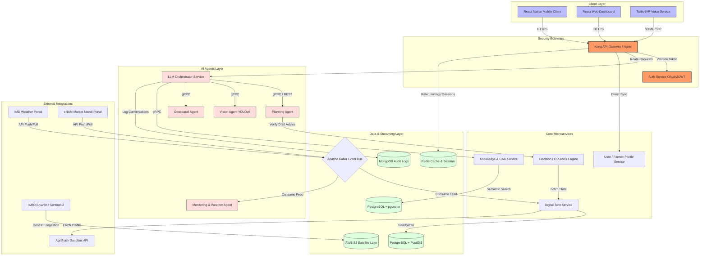

# System Architecture Specification: SasyaAI

This document defines the cloud-native, microservices-based architecture for **SasyaAI**, designed to scale to millions of farmers.

---

## 1. High-Level Architecture Diagram
The diagram below details the interaction between client applications, security boundaries, backend microservices, event streaming pipelines, and third-party data providers.



---

## 2. Microservices & Service Boundaries

SasyaAI is architected around a decoupled, domain-driven microservices layout. Each service operates in its own containerized environment with independent deployment lifecycles.

| Service Name | Primary Language/Framework | Service Boundary & Domain |
| :--- | :--- | :--- |
| `gateway-service` | Lua (Kong Gateway) / Python (FastAPI Gateway) | Rate-limiting, authentication routing, TLS termination, API aggregation. |
| `auth-service` | Python / FastAPI / PyJWT | Aadhaar OTP verification handler, OAuth 2.0 credentials manager, JWT generation and signing. |
| `user-service` | Python / FastAPI / SQLAlchemy | Manages basic identity records for farmers, officers, and administrators. Syncs with government schemas. |
| `digital-twin-service` | Python / FastAPI / Tortoise ORM | Computes the temporal state model of the farm (soil properties, historical crops, live coordinates). |
| `knowledge-service` | Python / FastAPI / LangChain | Manages scheme RAG lookup, fertilizer databases, and pest treatment lookup. Runs vector embeddings search. |
| `decision-engine` | Python / FastAPI / Google OR-Tools | Linear and integer mathematical programming service. Enforces safety margins, water quotas, and inputs budgets. |
| `planner-agent` | Python / FastAPI / LangGraph | Executes long-term crop rotation plans and matches farmer criteria to subsidy rules. |
| `vision-agent` | Python / FastAPI / YOLOv8 / PyTorch | Decodes leaf image binary inputs, returns pest/disease bounding boxes and classification indices. |
| `geospatial-agent` | Python / FastAPI / GDAL / Rasterio | Analyzes satellite raster maps, calculates NDVI, NDWI, and tracks land parcel borders. |
| `monitoring-agent` | Python / FastAPI / Celery | Periodically checks weather forecasts for dry spells or frosts, matches with active farm twins, raises outbound alerts. |

---

## 3. Database Ownership & Storage Strategy

To ensure loose coupling and database isolation, **no microservice may access another service's database directly**. All cross-domain data sharing must occur via REST/gRPC APIs or Kafka event streams.

* **PostgreSQL + PostGIS (Spatial Database):**
  * *Owner:* `digital-twin-service`
  * *Purpose:* Stores parcel coordinates (geometries), soil parameter histories, asset inventory, and crop calendars.
* **PostgreSQL + pgvector (Semantic Vector Store):**
  * *Owner:* `knowledge-service`
  * *Purpose:* Stores vector embeddings of agricultural literature, pesticide regulations, and government scheme eligibility guides.
* **MongoDB Atlas (Document Store):**
  * *Owner:* `gateway-service` & `monitoring-agent`
  * *Purpose:* Auditable advisory logs, unstructured chat and IVR transcripts, sensor telemetry telemetry histories.
* **Redis Cluster (In-Memory Key-Value Store):**
  * *Owner:* `auth-service` & `gateway-service`
  * *Purpose:* Rate limit tokens, authenticated user sessions, and cached responses for standard meteorological data.
* **AWS S3 / Azure Blob Storage (Object Lake):**
  * *Owner:* `geospatial-agent`
  * *Purpose:* Satellite raw tiles, Sentinel GeoTIFFs, and farmer-uploaded pest diagnosis images.

---

## 4. Communication Protocols

```
┌──────────────┐         HTTPS (JSON)         ┌───────────────┐
│ Mobile / IVR │ ───────────────────────────► │  API Gateway  │
└──────────────┘                              └───────────────┘
                                                      │
                                                      │ gRPC (Protobuf)
                                                      ▼
                                              ┌───────────────┐
                                              │ Orchestrator  │
                                              └───────────────┘
                                                /     │     \
                                       gRPC    /      │      \   gRPC
                                              ▼       ▼       ▼
                                         ┌────────┐ ┌────────┐ ┌────────┐
                                         │ Vision │ │ Geosp. │ │ Decision│
                                         └────────┘ └────────┘ └────────┘
```

### 4.1 Synchronous Communication
* **External-to-Internal:** HTTP/HTTPS using RESTful JSON payloads. Tightly bound via OpenAPI specs. Used for customer-facing transactions (app login, profile edits).
* **Internal-to-Internal (Latency-Critical):** gRPC using Protocol Buffers (Protobuf). Used for inter-agent communication and OR-Tools verification to minimize network overhead and enforce type safety.

### 4.2 Asynchronous Communication
* **Event Streaming (Apache Kafka):** External weather feeds (IMD), market price variations (eNAM), and IoT sensor streams publish directly to corresponding Kafka topics:
  * `weather.imd.alerts`
  * `market.enam.prices`
  * `digitaltwin.updates`
* **Task Queues (Celery + Redis):** Used for heavy, long-running asynchronous tasks such as generating PDF crop plans, outbound IVR voice queues, and satellite tile downloading.

---

## 5. Security Architecture

* **Authentication:** Stateless JWT tokens containing `AgriStack ID`, `Role`, and expiration timestamp. Signed using RS256 private/public keypair. Valid for 60 minutes.
* **Network Segmentation:** Deployed inside a virtual private cloud (VPC) with public subnets reserved exclusively for the API Gateway and NAT Gateways. Core microservices reside in private subnets and are unreachable from the public internet.
* **Transport Encryption:** TLS 1.3 is enforced for all ingress traffic. Internal service-to-service communication is secured via mutual TLS (mTLS) managed by a Linkerd or Istio Service Mesh.
* **Data Privacy (DPDP Compliance):** Implement a dedicated Consent Store within the user service. All read APIs verifying PII must check the user's active digital consent signature prior to data aggregation.

---

## 6. Scaling & High Availability Strategy

* **Horizontal Autoscaling:** Kubernetes Horizontal Pod Autoscaler (HPA) monitors CPU/Memory utilization.
* **Queue-Based Scaling (KEDA):** For task workers (`monitoring-agent`, `geospatial-agent`), Kubernetes Event-Driven Autoscaler (KEDA) scales pod counts dynamically based on Kafka topic lag and Redis queue depth.
* **Database Scaling:** PostgreSQL is configured with one primary instance (Write) and two read-replicas inside separate Availability Zones (AZ) to balance transactional load.
* **Edge Caching:** Static parameters (crop types, regional mandis) are stored in the local SQLite DB inside the mobile client to limit backend load.

---

## 7. Disaster Recovery & Backup Plan

* **Backup Operations:** Automated incremental backups of PostgreSQL databases run every 6 hours, replicated to cold storage in a secondary AWS region (e.g., `ap-south-2` Hyderabad).
* **Metrics Targets:**
  * **Recovery Point Objective (RPO):** < 6 Hours (Max data loss target in case of catastrophic site failure).
  * **Recovery Time Objective (RTO):** < 4 Hours (Target restoration duration for core advisory services).
* **Active-Passive Setup:** A backup passive deployment configuration is maintained in a secondary cloud region. DNS routing can be shifted via Route53 in case of a primary region outage.
